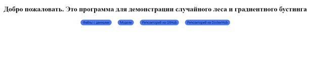
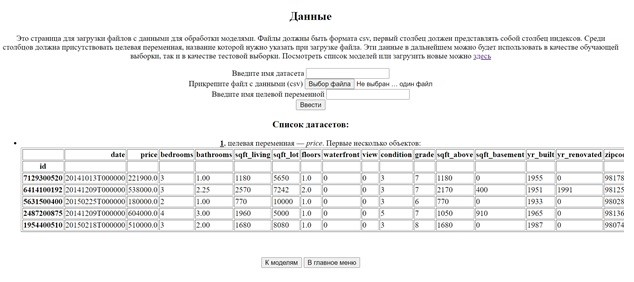
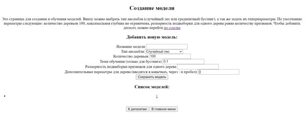
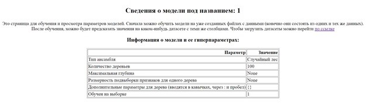
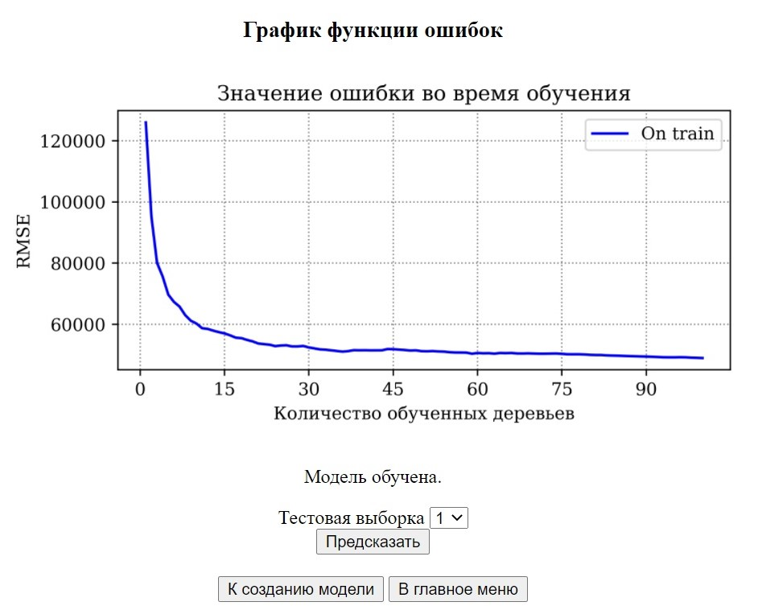

## MMF_practicum_task_3
    Репозиторий для 3 практического задания по практикуму на ЭВМ кафедры ММП осень 2021
    
    Данный мануал посвящен принципам работы данного проекта. При запуске открывается главное меню, в котором есть 4 разные ссылки.
    Последние 2 ведут на github и dockerhub с данным проектом.
    
    Первая ведет на страницу загрузки датасетов. 
    В нем можно прикрепить csv файл и указать название датасета и целевую переменную. 
    Если указанной целевой переменной не будет csv, то программа будет требовать существующую в таблице.
    
    С этой страницы можно перейти на страницу создания моделей. На ней можно выбрать вид модели, а также задать свои параметры.
    
    После выбора нужных допустимых параметров можно перейти на страницу информации о модели. 
    На ней видны заданные при создании параметры, а также есть возможность обучить модель на ранее созданном датасете и использовать валидационную выборку.
    После обучения в информации о моделе появится строка о том, на какой моделе она обучалась, также будет нарисован график функции потерь и показан несколько первых строк обучающей выборки.
    Далее можно обучить модель. Полученные данные в виду их возможного большого размера скачиваются в виде csv файла.
    
Для собственной сборки можно воспользоваться командами:
1. `docker build -t bychkovgk/ensembles .`
2. `docker run -p 5000:5000 --rm -i bychkovgk/ensembles`
